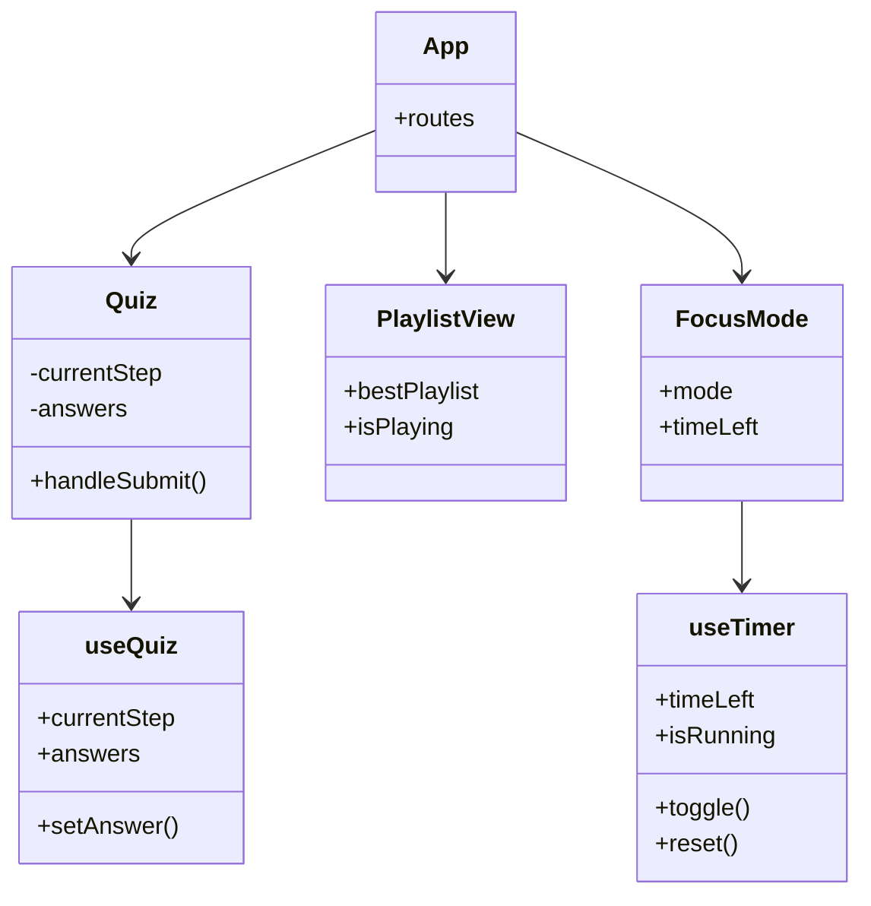

# Architect - BeatsPerMind

## Decyzje Techniczne

### Stack Decisions
| Warstwa | Technologia | Powód |
|---------|-------------|-------|
| Frontend | React 18 + Vite | Szybki setup, zero config |
| Styling | Tailwind CSS + shadcn/ui | Gotowe komponenty |
| Routing | React Router v6 | Standard przemysłu |
| State | useState + Context | Wystarczające dla MVP |
| Audio | HTML5 Audio + YouTube Embed | Proste usecase |
| Data | Static JSON + localStorage | Zero kosztów |
| Hosting | Vercel | Free tier, easy deploy |

### Architektura Komponentów
```
Component Hierarchy:
App.jsx (Router)
├── Landing.jsx
├── Quiz.jsx → useQuiz hook
├── PlaylistView.jsx
│   ├── LearnMore.jsx
│   └── FocusMode button
├── FocusMode.jsx
│   ├── Timer.jsx → useTimer hook
│   └── AmbientPlayer.jsx → useAudio hook
└── Navigation.jsx
```

## Modele Systemu

### Component Model


### Data Model
```
Playlist JSON Schema:
{
  "id": "playlist-1",
  "title": "Deep Focus Instrumental",
  "youtubePlaylistId": "PLxxxxxxxxx",
  "spotifyUrl": "https://...",
  "tags": {
    "activity": "study",
    "energy": "low",
    "lyrics": "instrumental"
  },
  "bpm": "60-80"
}

AmbientSound Schema:
{
  "id": "rain",
  "name": "Rain",
  "icon": "CloudRain",
  "src": "/sounds/rain.mp3",
  "color": "blue"
}
```

### State Flow
```
Quiz Flow:
User answers → useQuiz stores → playlistMatcher → PlaylistView

Timer Flow:
useTimer manages (work/break) → FocusMode displays → Auto-switch at 0

Audio Flow:
AmbientPlayer sets sound → useAudio plays → Volume control
```

## Integracje

### External Integrations
| Service | Typ | Status |
|---------|-----|--------|
| YouTube Embed | Embed iframe | ✅ Active |
| Spotify Link | External URL | ✅ Active |
| Vercel | Hosting | ✅ Active |

### YouTube Integration Details
- **Method:** Embed iframe (not API)
- **URL Format:** `https://www.youtube.com/embed/videoseries?list={PLAYLIST_ID}&autoplay=1`
- **Benefits:** 
  - No API key needed
  - No quota limits
  - Autoplay support
  - Full playlist playback

### Future Integrations (Not MVP)
| Integration | When | Priority |
|-------------|------|----------|
| Supabase Auth | Phase 2 | Low |
| Spotify API | User requested | Medium |
| Stripe | Monetization | Low |